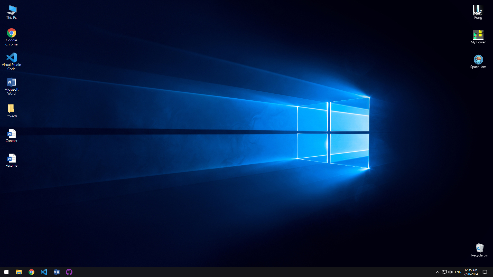

# Windows-Inspired Portfolio



<p align="center">
  
  
  
  
  
</p>

## Overview

Welcome to the Windows-Inspired Portfolio project! This project is a web-based portfolio designed to mimic the look and feel of the Windows operating system. It includes a start menu, desktop, and interactive apps that showcase your projects, resume, and contact information in a unique and nostalgic way.

## Table of Contents

- [Features](#features)
- [Demo](#demo)
- [Installation](#installation)
- [Usage](#usage)
- [Customization](#customization)
- [Contributing](#contributing)
- [License](#license)

## Features

- **Start Menu**: A familiar Windows-inspired start menu that provides access to your portfolio's apps and content.

- **Desktop**: A desktop environment where you can place icons and interact with your portfolio items.

- **Apps**: Interactive apps that act as containers for your projects, resume, and contact information. These apps are designed to resemble real Windows applications.

- **Projects**: Showcase your projects in an engaging way. Each project can include images, descriptions, and links to more details.

- **Resume**: Display your resume or CV in a structured and readable format.

- **Contact**: Share your contact information, including links to social media profiles and email.

- **Responsive Design**: The portfolio is designed to work seamlessly on various screen sizes and devices.

## Demo

You can see a live demo of this portfolio [here](https://windows-portfolio-v2.vercel.app/).

## Installation

1. Clone the repository:

   ```bash
   git clone https://github.com/CojaDev/WindowsPortfolio
