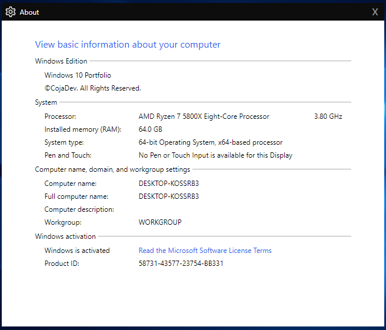

# Windows-Inspired Portfolio


<p align="center">
  
  
  
  
  
</p>

## Overview

Welcome to the Windows-Inspired Portfolio project! This project is a web-based portfolio designed to mimic the look and feel of the Windows operating system. It includes a start menu, desktop, and interactive apps that showcase your projects, resume, and contact information in a unique and nostalgic way.

## Features

- **Start Menu**: A familiar Windows-inspired start menu that provides access to your portfolio's apps and content.
- **Desktop**: A desktop environment where you can place icons and interact with your portfolio items.
- **Apps**: Interactive apps that act as containers for your projects, resume, and contact information. These apps are designed to resemble real Windows applications.
- **Projects**: Showcase your projects in an engaging way. Each project can include images, descriptions, and links to more details.
- **Resume**: Display your resume or CV in a structured and readable format.
- **Contact**: Share your contact information, including links to social media profiles and email.
- **Responsive Design**: The portfolio is designed to work seamlessly on various screen sizes and devices.

## Demo

You can see a live demo of this portfolio [here](https://windows-portfolio-v2.vercel.app/).

## Customization

You can customize the portfolio's appearance and content to suit your preferences:

- **Themes**: Change the color scheme and styling in the `css` directory.
- **Icons**: Replace the icons in the `apps/assets/icons` directory with your own icons.
- **Fonts**: Modify the font styles in the `css` directory by editing the CSS files.

## Contributing

Contributions to this project are welcome! If you have ideas for improvements or find bugs, please open an issue or submit a pull request.

## Installation

1. Clone the repository:
    ```sh
    git clone https://github.com/CojaDev/WindowsPortfolioV2
    ```

2. Navigate to the project directory:
    ```sh
    cd ecomFront
    ```

3. Install the dependencies:
    ```sh
    npm install
    ```

4. Run the development server:
    ```sh
    npm run dev
    ```

5. Open your browser and visit `http://localhost:3000` to view the site.
   
## License

This project is licensed under the MIT License - see the [LICENSE](LICENSE) file for details.

---

Thank you for using the Windows-Inspired Portfolio project. I hope it helps you showcase your work in a creative and engaging way! If you have any questions or need assistance, feel free to reach out to me.
